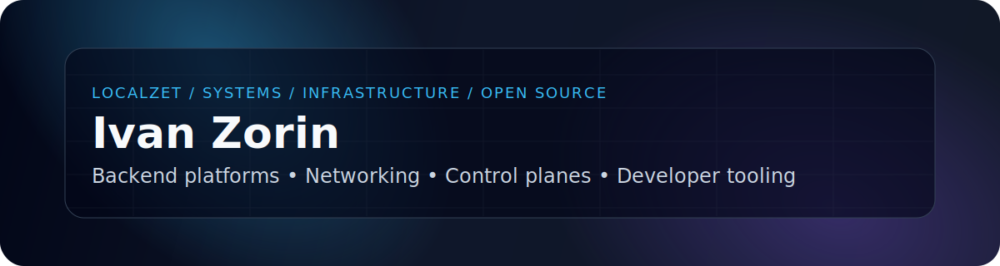
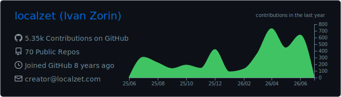
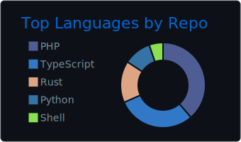
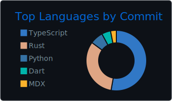
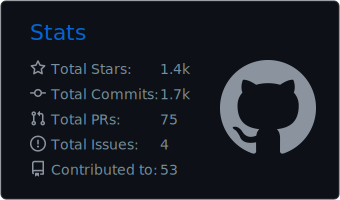

<p align="center">
  
</p>

<p align="center">
  <a href="https://github.com/localzet">
    
  </a>
  <a href="https://www.localzet.com">
    
  </a>
  <a href="https://t.me/localzet">
    
  </a>
  <a href="https://t.me/localzet_dev">
    
  </a>
  <a href="https://orcid.org/0000-0002-2608-4703">
    
  </a>
</p>

---

### Engineering profile

I build open-source systems, infrastructure tooling, backend platforms and control-plane software.

My work usually sits close to the operational layer: services, runtimes, networking, automation, observability, security primitives, developer tooling and self-hosted platforms.

---

### Work areas

<p align="center">
  
  
  
  
  
</p>

```txt
systems          backend runtimes, Linux services, self-hosted infrastructure
networking       proxies, tunnels, relay systems, Xray tooling, secure channels
platforms        control panels, SDKs, automation, CI/CD and developer tooling
data / ai        embeddings, vector search, RAG, ML-assisted infrastructure
security         auth, tokens, encryption experiments, hardening and diagnostics
````

---

### GitHub activity

<p align="center">
  
</p>

<p align="center">
  
  
  
</p>

---

### Technology map

```txt
languages        Rust, C, C++, TypeScript, Python, PHP, Go, C#
backend          REST, WebSockets, async runtimes, event-driven services
infra            Linux, Docker, Nginx, PostgreSQL, Redis, RabbitMQ
networking       WireGuard, tunnels, proxies, gRPC, mail/server protocols
frontend         Vue, Nuxt, React, Next.js, TailwindCSS
ai / data        RAG, embeddings, vector search, Qdrant, ML prototypes
```

---

### Ecosystem

<p align="center">
  <a href="https://github.com/localzet-dev">
    
  </a>
  <a href="https://github.com/Triangle-org">
    
  </a>
  <a href="https://www.npmjs.com/~localzet">
    
  </a>
  <a href="https://packagist.org/packages/localzet/">
    
  </a>
</p>

---

<p align="center">
  <sub>
    Building tools for people who run, debug and maintain systems.
  </sub>
</p>
